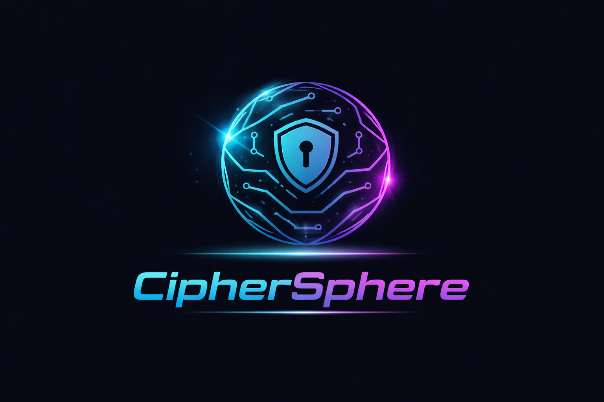
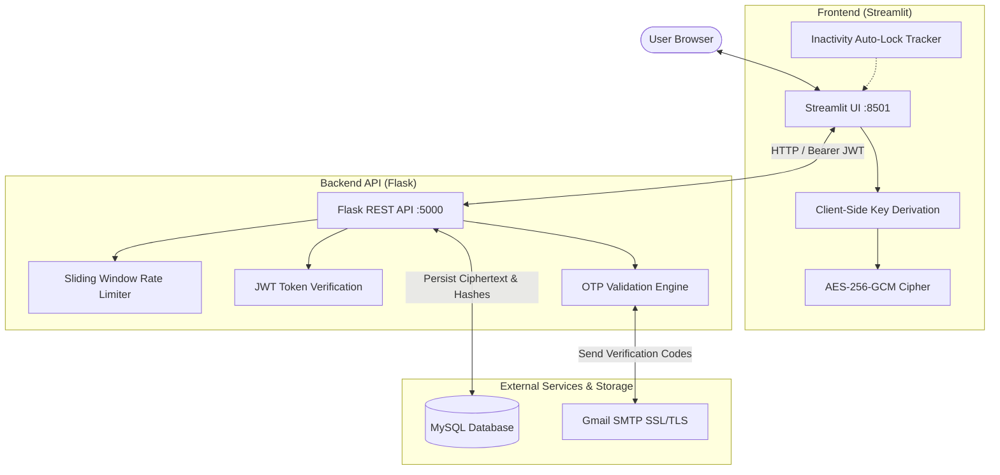

<p align="center">
  
</p>

<h1 align="center">CipherSphere</h1>

<p align="center">
  <strong>A Zero-Knowledge, End-to-End Encrypted Personal Password Vault & Credential Manager</strong>
</p>

<p align="center">
  <a href="https://www.python.org/"></a>
  <a href="https://streamlit.io/"></a>
  <a href="https://flask.palletsprojects.com/"></a>
  <a href="https://www.mysql.com/"></a>
  <a href="https://pycryptodome.readthedocs.io/"></a>
  <a href="#"></a>
  <a href="LICENSE"></a>
</p>

---

## 📑 Table of Contents

- [Overview](#-overview)
- [Key Features](#-key-features)
- [Security & Cryptographic Architecture](#-security--cryptographic-architecture)
- [System Architecture](#-system-architecture)
- [Tech Stack](#-tech-stack)
- [Project Structure](#-project-structure)
- [Getting Started](#-getting-started)
  - [Prerequisites](#prerequisites)
  - [Installation](#installation)
  - [Environment Configuration](#environment-configuration)
  - [Running the Application](#running-the-application)
- [API Reference](#-api-reference)
- [Threat Model & Defensive Guarantees](#-threat-model--defensive-guarantees)
- [Contributing](#-contributing)
- [License](#-license)

---

## 🌟 Overview

**CipherSphere** is a high-security, full-stack password vault designed around a strict **zero-knowledge architecture**. 

Unlike conventional storage systems that hold master secrets in server memory or databases, CipherSphere ensures that **your master password never leaves your browser**. All vault encryption and decryption processes occur client-side, converting sensitive credentials into authenticated ciphertext before transmission. Even in the event of a full database breach, stored credentials remain cryptographically unreadable without the user's master key.

---

## ✨ Key Features

### 🛡️ Zero-Knowledge Vault
- **Authenticated Encryption**: Every secret is shielded with **AES-256-GCM**, providing both confidentiality and cryptographic integrity verification.
- **Unique Per-Entry Salts**: Each stored record generates a distinct 128-bit cryptographic salt and unique nonce, preventing cross-entry pattern matching and rainbow table attacks.
- **Master Password Privacy**: The server never stores, caches, or receives the master password in plaintext.

### 🔐 Multi-Factor & Authentication Flows
- **Email OTP Verification**: Account registrations and password recoveries require a 6-digit one-time password delivered over secure SMTP TLS/SSL.
- **Strict Password Policies**: Enforces length, casing, digit, and symbol diversity, with built-in heuristics targeting repeated sequences and common keyboard patterns.
- **JWT Session Tokens**: Cryptographically signed JSON Web Tokens (HS256) with 8-hour automatic expiration.
- **Self-Service Password Reset**: Dedicated login-password recovery workflow that safely protects vault encryption keys from reset impact.

### ⚡ Built-in Productivity & Security Utilities
- **Diceware-Style Passphrase Generator**: Generates memorable, high-entropy passphrases with custom separators, capitalization, digits, and entropy-bit calculations.
- **Real-Time Password Strength Meter**: Immediate visual feedback highlighting missing character classes and predictable dictionary patterns.
- **Memory Aid Hints**: Optional, user-defined hints for remembering the master password without exposing cryptographic primitives.
- **Auto-Lock Inactivity Timer**: Client-side monitoring locks the vault automatically after periods of user inactivity.

### 🗄️ Complete Vault Governance
- **Full CRUD Management**: View, add, update, search, and delete individual credentials seamlessly.
- **Dual-Confirmation Safeguards**: High-impact operations (such as purging an entire vault or deleting an account) require dual authentication via both login and master passwords.

---

## 🔒 Security & Cryptographic Architecture

CipherSphere uses industry-standard cryptographic primitives implemented via [PyCryptodome](https://pycryptodome.readthedocs.io/):

| Security Domain | Implementation | Security Benefit |
| :--- | :--- | :--- |
| **Vault Encryption** | `AES-256-GCM` | Authenticated encryption prevents tampering or ciphertext bit-flipping attacks. |
| **Key Derivation (Vault)** | `PBKDF2-HMAC-SHA256` (100,000 iterations) | Derives 256-bit AES keys from master passwords with computational hardness against GPU cracking. |
| **Login Password Hashing** | `PBKDF2-HMAC-SHA256` (260,000 iterations) | OWASP-recommended iteration count for secure login credential persistence. |
| **Timing Attack Mitigation** | `secrets.compare_digest` + dummy padding | Guarantees constant-time comparison across authentication checks. |
| **Brute-Force Protection** | In-Memory Sliding Window Rate Limiter | Restricts failed attempts and rapid automated requests on sensitive endpoints. |
| **OTP Security** | Cryptographically secure random tokens (`secrets`) | 5-minute time-to-live (TTL) and maximum attempt limits per token cycle. |

---

## 🏛️ System Architecture



---

## 💻 Tech Stack

- **Frontend**: [Streamlit](https://streamlit.io/) (Interactive web UI with custom glassmorphic theming)
- **Backend**: [Flask](https://flask.palletsprojects.com/) (RESTful API architecture with CORS & rate-limiting)
- **Database**: [MySQL](https://www.mysql.com/) (Relational persistence with foreign-key cascade policies)
- **Cryptography**: [PyCryptodome](https://pycryptodome.readthedocs.io/) (AES-256-GCM, PBKDF2)
- **Session Security**: [PyJWT](https://pyjwt.readthedocs.io/) (HMAC-SHA256 signed session tokens)
- **Communication**: Python Standard Library `smtplib` over SSL/TLS

---

## 📁 Project Structure

```text
Ciphersphere/
├── backend/
│   └── backend.py          # Flask REST API, authentication, and database schemas
├── frontend/
│   ├── app.py             # Streamlit application, UI components, and client-side encryption
│   └── logo.png           # Project branding logo
├── .env                   # Environment variables (excluded from git)
├── .gitignore             # Git ignore patterns (.env, virtual environments, caches)
├── requirements.txt       # Python project dependencies
└── README.md              # Project documentation
```

---

## 🚀 Getting Started

### Prerequisites

Ensure you have the following installed on your machine:
- **Python**: Version `3.10` or higher
- **MySQL Server**: Running locally or on an accessible remote host
- **Git**

### Installation

1. **Clone the repository**:
   ```bash
   git clone https://github.com/Puja2059/Ciphersphere.git
   cd Ciphersphere
   ```

2. **Create and activate a virtual environment**:
   - **Windows (PowerShell)**:
     ```powershell
     python -m venv .venv
     .venv\Scripts\Activate.ps1
     ```
   - **Windows (Command Prompt)**:
     ```cmd
     python -m venv .venv
     .venv\Scripts\activate.bat
     ```
   - **Linux / macOS**:
     ```bash
     python3 -m venv .venv
     source .venv/bin/activate
     ```

3. **Install dependencies**:
   ```bash
   pip install -r requirements.txt
   ```

---

## ⚙️ Environment Configuration

Create a `.env` file in the root directory of the project. You can generate a secure `JWT_SECRET_KEY` using Python:

```bash
python -c "import secrets; print(secrets.token_hex(32))"
```

Populate `.env` with your configuration:

```env
# Security
JWT_SECRET_KEY=your_generated_64_character_hex_secret

# Database Configuration
DB_HOST=localhost
DB_PORT=3306
DB_USER=your_mysql_username
DB_PASSWORD=your_mysql_password
DB_NAME=ciphersphere_db

# Email / SMTP Configuration (Gmail)
SMTP_USER=your_email@gmail.com
GMAIL_APP_PASSWORD=your_16_digit_google_app_password
SMTP_FROM=your_email@gmail.com
```

> **Note**: Database tables (`users`, `vaults`, `password_reset_log`, `master_password_hints`) are created automatically when the backend server initializes. Ensure the specified MySQL database exists prior to launching.

---

## 🏃 Running the Application

### 1. Start the Flask Backend
Open a terminal, activate your virtual environment, and navigate to the backend folder:

```bash
cd backend
python backend.py
```
*The backend API will start on `http://127.0.0.1:5000`.*

### 2. Start the Streamlit Frontend
Open a second terminal, activate the virtual environment, and launch Streamlit:

```bash
cd frontend
streamlit run app.py
```
*The frontend application will open in your default browser at `http://localhost:8501`.*

---

## 📡 API Reference

| Method | Endpoint | Auth Required | Description |
| :--- | :--- | :---: | :--- |
| `GET` | `/generate_passphrase` | No | Generates a high-entropy passphrase with custom words and separators |
| `POST` | `/send_otp` | No | Dispatches a 6-digit verification code to the target email |
| `POST` | `/verify_otp` | No | Validates an active OTP for the specified email |
| `POST` | `/signup` | No | Registers a new account with a PBKDF2-hashed login password |
| `POST` | `/login` | No | Authenticates user credentials and issues a signed JWT token |
| `POST` | `/reset_login_password/request` | No | Initiates login-password reset sequence via email OTP |
| `POST` | `/reset_login_password/confirm` | No | Updates login password upon successful OTP confirmation |
| `GET` | `/vault` | Yes | Retrieves and decrypts user vault records using the master password |
| `POST` | `/vault` | Yes | Encrypts and persists a new vault entry |
| `PUT` | `/vault` | Yes | Updates an existing vault entry |
| `DELETE` | `/vault` | Yes | Wipes all entries in the user's vault |
| `DELETE` | `/vault/entry` | Yes | Deletes an individual vault entry by index |
| `POST` | `/hints` | Yes | Saves plain-text memory hints for the master password |
| `GET` | `/hints` | Yes | Retrieves saved memory hints |
| `DELETE` | `/hints` | Yes | Clears all memory hints |
| `DELETE` | `/account` | Yes | Permanently removes user account and cascades all vault data |

---

## 🛡️ Threat Model & Defensive Guarantees

- **Database Compromise**: If the underlying MySQL database is compromised, an attacker obtains only salted PBKDF2 login hashes and AES-256-GCM ciphertexts with isolated per-record salts. Without individual user master passwords, vault contents cannot be decrypted.
- **Server Blindness**: Because master passwords are used purely as client-side key derivation inputs, the server has no record of them in logs, memory dumps, or persistence stores.
- **Timing Attacks**: All string matching against hashes and security tokens employs constant-time algorithms, mitigating side-channel timing analysis.
- **Replay & Hijacking**: Session tokens enforce strict expiration horizons, and OTP codes expire after 5 minutes with strict retry limits.

---

## 🤝 Contributing

Contributions, issues, and feature requests are welcome!
1. Create your Feature Branch (`git checkout -b feature/AmazingFeature`)
2. Commit your Changes (`git commit -m 'Add some AmazingFeature'`)
3. Push to the Branch (`git push origin feature/AmazingFeature`)
4. Open a Pull Request

---

## 📄 License

Distributed under the **MIT License**. See `LICENSE` for more information.
